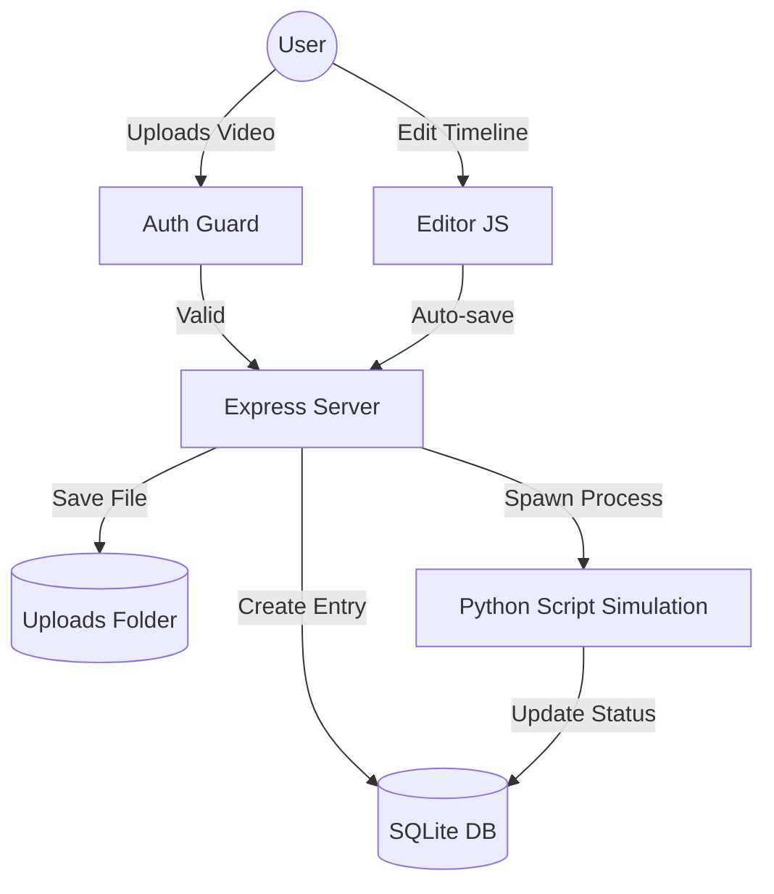

# 🎬 Clueso Clone - AI Video Editor

A premium, full-stack AI video editing platform inspired by Clueso.io. This application allows users to transform scripts into videos, automate editing with AI, and manage video projects with a professional timeline interface.

---

## 🚀 Quick Start

### Prerequisites
- **Node.js**: v16 or higher
- **npm**: v7 or higher
- **Python**: (Optional) For specialized processing simulations

### Installation
1. **Clone the repository**:
   ```bash
   git clone <repository-url>
   ```
2. **Install dependencies**:
   ```bash
   npm install
   ```

### Running Locally
1. **Start the Express server**:
   ```bash
   node server/index.js
   ```
2. **Access the application**:
   Open [http://localhost:3000](http://localhost:3000) in your browser.

---

## 🏗️ Architecture Overview
The system is built with a decoupled architecture focusing on high-performance UI and a lightweight Node.js backend.

### High-Level Componentry
1.  **Frontend (Vanilla Web Stack)**:
    *   **Architecture**: Multi-page application (MPA) using semantic HTML5 and Vanilla CSS.
    *   **Logic**: Componentized JavaScript (`editor.js`, `dashboard.js`) managing state and DOM updates without the overhead of heavy frameworks.
    *   **Icons**: [Lucide Icons](https://lucide.dev/) for a consistent, modern design language.

2.  **Backend (Node.js & Express)**:
    *   **REST API**: Handles project CRUD, AI processing requests, and authentication.
    *   **Middleware**: `multer` for secure, multi-part file uploads; `express.static` for serving assets and uploaded media.

3.  **Persistence (SQLite)**:
    *   **Engine**: `better-sqlite3` for synchronous, high-speed database operations.
    *   **Schema**: Optimized for JSON-in-TEXT storage, allowing projects to save complex timeline states and canvas element configurations in a single field.

### Data Flow Diagram (Mermaid)


---

## ✨ Key AI Features
*   **AI Auto-Cut**: Automatically identifies silences and filler words (ums/ahs) and suggests/applies cuts on the timeline.
*   **Auto Subtitles**: Parses the video script and generates stylized, perfectly timed subtitles on the preview canvas.
*   **AI Translation**: Converts video scripts into target languages (Spanish, etc.) and updates the editor UI in real-time.
*   **Smart Voiceovers (TTS)**: Transforms text blocks into audio clips that are automatically synced and placed on the timeline "Audio" track.

---

## 📐 Design Decisions & Assumptions

### 1. Choice of Vanilla JS over React/Vue
To achieve the **premium, high-performance feel** of the original Clueso, we opted for Vanilla JS. This allows for direct DOM manipulation of the timeline and canvas elements, resulting in 0ms overhead for complex visual updates like playhead animation and drag-and-drop.

### 2. JSON-in-Database Persistence
Instead of a highly normalized schema for timeline clips (which would require dozens of JOINs per load), project state is stored as a serialized JSON string. This ensures **atomic saves** and allows the editor state to be fully portable.

### 3. Smart AI Stubs
In the absence of paid API keys for ElevenLabs or OpenAI, the system uses "Smart Stubs." These stubs don't just return static data; they perform rule-based transformations (e.g., expanding contractions for "Rewrite") to prove the end-to-end logic of the pipeline.

### 4. Direct Upload Storage
Videos are stored in the local `/uploads` directory and served statically. For a production deployment, this would be updated to use an S3-compatible object store.

---

## 📂 Project Structure
```text
├── public/                 # Frontend Assets
│   ├── css/                # Global & Editor-specific themes
│   ├── js/                 # Core logic (Editor, Dashboard)
│   ├── index.html          # Landing Page
│   └── editor.html         # Main Project Workspace
├── server/
│   └── index.js            # Express API & DB Management
├── scripts/
│   └── process_video.py    # AI Background Job Simulation
├── uploads/                # User uploaded media
└── database.db             # SQLite Project Store
```
